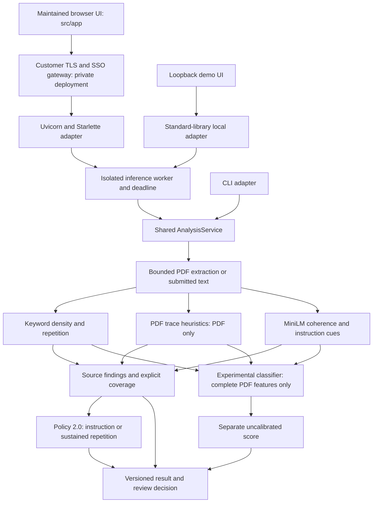

# Current system architecture

Updated October 3, 2026. This describes the maintained implementation; older plans and experimental reports are historical.

## Runtime and trust boundaries

ATS Final Boss is an input-level resume inspection tool. It reports evidence and coverage before a downstream screening decision. It does not verify claims, determine hiring suitability or establish a probability of dishonesty.

Instruction detection, sentence cue explanations and source-span evidence share
normalized-text clause boundaries indexed once per invocation. Local quoted
examples remain excluded and later actionable matches remain eligible. Source
anchors retain original offsets and abstain on unmappable Unicode composition.
This improves consistency and avoids repeated sentence-prefix scans; it does
not make lexical instruction detection comprehensive.

Generic role markers, system/admin labels and API-format guidance do not independently
trigger review, even alongside hiring terminology. Actionable score/rank/eligibility,
rejection and hiring commands target an applicant or candidate document. Existing
instruction overrides remain cues. This reduces known ATS engineering false flags
while allowing vague/remote-target attacks to evade the lexical layer; never equate
no cues with a safe document. See [precision change](progress/APPLICANT_INTENT_PRECISION_2026-10-03.md).

The CLI and HTTP worker use `src/core/analysis_service.py`; adapters do not invent PDF structural scores for plain text. The API bounds uploads, rejects concurrent analysis, uses an isolated worker with a deadline and cleans temporary files. PDF parsing is limited to 20 pages and 100,000 extracted characters. Unsupported, encrypted, scanned-only, incomplete and failed analyses expose coverage limitations. OCR is not implemented.

Uploaded documents are untrusted data. Normal inference requires a data-only V2
candidate, never uploaded weights or serialized Python objects. Manifests are capped
at 256 KiB and require exactly three hashes: linear_model.json (16 KiB), thresholds.json
and model_config.json (1 MiB each). Hashes stream in bounded chunks; exact bounded
bytes are rechecked and strictly parsed. Feature/class order, finite parameters and
inputs, positive scaler scales and sklearn prediction parity are checked. Linked/special
files and ambiguous JSON are refused. Independent pins and immutable approved mounts
remain necessary: integrity is not provenance.

V1 supports integrity inspection and explicit operator-trusted offline migration only.
CLI/HTTP serving refuses V1 and unmanifested pickle files. Migration retains source
provenance but drops validation/approval claims and marks output unapproved. Training
writes V2 with the canonical policy hashes, including evidence and linear inference.
Old studies are not rewritten. Native memory containment and customer deployment are
separate open gates. See [change record](progress/PRECISION_AND_DATA_ONLY_2026-10-02.md).

Private mode additionally requires an independently pinned manifest digest, verifies policy hashes, and parses the exact verified data-only bytes. It requires Linux resource limits and an authenticated customer gateway. Host/Origin guards, bearer authentication, connection limits and a global request budget apply before analysis. Local mode refuses network-wide binding. The proposed container is non-root, read-only and resource-limited; hosted synthetic container smoke passes, while real pinned-model deployment and customer SSO/TLS acceptance remain unverified. See [private pilot guide](PRIVATE_PILOT.md).

`src/app/asgi.py` is the maintained private HTTP adapter. Uvicorn runs one server process with a concurrency cap; the application limits body size and total upload time before passing validated payloads to the shared isolated worker. Private startup validates pinned artifacts and performs a synthetic warm-up before accepting traffic, eliminating the earlier readiness/warm-up routing cycle. Static UI and API requests require gateway-injected authentication. Lifespan shutdown stops worker admission and coordinates cleanup; model work stays outside the HTTP process.

The worker owns its process and pipe under a request lock. A stop event cancels active work during bounded polling and prevents new requests; shutdown no longer closes a pipe concurrently with a request. Spawn failures clean up both endpoints. The deployment validator rejects weakened Compose controls, while CI adds a data-free image build and smoke test. These are testable architecture controls, not proof of runtime isolation or external security certification.

Private embedding exports have their own independently pinned integrity contract and are loaded from a reviewed local safetensors directory. Startup exercises multi-sentence semantic encoding and a synthetic PDF, then checks detector statuses and classifier coverage before serving. Readiness respects stop admission, and private child diagnostics cannot bypass redacted parent response logs. Shared container memory remains a containment limitation; the worker virtual-address limit must not be interpreted as a physical-RAM bound.

## Worker message contract

The HTTP parent maintains a fixed-cardinality, thread-safe registry of analysis POST status counters and HTTP200/non200 response-preparation histograms. Authenticated `/metrics` and `/api/v1/metrics` exports contain no candidate content or request identifiers. Metrics reset with the process; ASGI pre-dispatch rejections remain unobserved. The browser gateway denies telemetry routes by default; separately approved internal collection and alerts remain customer responsibilities. See [runtime metrics](OPERATIONS_METRICS.md).

The versioned `/api/v1/review` projection carries only closed-vocabulary decisions, observation counts and coverage, through the same worker and admission controls. The server-side SDK rejects unknown/ambiguous responses, redirects and unavailable work. This projection does not sanitize documents, verify employment facts or confer downstream model immunity. The [paired observation harness](DOWNSTREAM_BENCHMARK.md) compares supplied frozen-protocol results without running models or opening resumes; imported observations do not independently establish accuracy or business impact. See [integration boundaries](INTEGRATION.md).

Both HTTP adapters share the persistent worker. Versioned JSON bytes replace executable pickle IPC, with 7 MiB plus 8 KiB request envelopes and 8 MiB replies. A per-request identifier prevents stale responses; invalid framing, nesting, non-finite values and response envelopes dispose of the worker. Send and entire reply parsing are covered by the configured inference deadline, followed by bounded termination/cleanup waits. Error messages are parent-owned constants. This is not separate physical-memory containment. See [the boundary change record](progress/WORKER_BOUNDARY_2026-09-30.md).

PDF responses expose `coverage.pdf_visibility` separately from supported Module B trace completion. Pixel visibility, complete optional-content reasoning and OCR are not implemented in the production detector. The experimental raster tool remains outside policy/model inference.

## Evidence, policy and score

- Module A computes token-aware skill density and concentration. Module C uses off-the-shelf MiniLM sentence-window coherence plus normalized, locally contextual instruction patterns. Positive P95 thresholds come only from source-disjoint clean validation examples; invalid/zero thresholds disable the affected score.
- Module B uses PyMuPDF text traces for invisible rendering, tiny fonts, off-page/degenerate boxes, optional-content layers and heuristic background matches. It does not fully resolve clipping, occlusion, OCR or pixel visibility. Disabled optional-content groups mark coverage partial.
- Policy 2.0 recommends review for direct instruction cues or sustained skill repetition. Structural anomalies, density, semantic variance and experimental classifier predictions remain advisory. The stricter gate reduces false alarms but can miss subtler attacks. Findings expose `review_trigger` and uncertainty.
- The classifier consumes A/B/C features in a fixed order, scales once and selects class 1 explicitly. Its output is uncalibrated and separate from the review decision. Plain text or incomplete PDF evidence cannot produce a combined score. A review rule never rewrites the numeric score.
- Result schema 2.0 exposes status, policy version, model identity, decision, reason codes, coverage, modules, findings and timings. Missing evidence yields `insufficient_evidence`; absence of a review trigger does not establish authenticity.

Exact text anchors use original Unicode code-point offsets and abstain on ambiguous normalization mappings. PDF findings retain page/trace regions. On-demand previews render at most three finding pages, 900 pixels per side and 2 MiB total PNG data. Preview highlights locate traces, not intent. Images and submitted source text are excluded from the exported analysis JSON. Full causal explanations and complete PDF visibility remain open work.

## Research workflow

`scripts/acquire_resume_dataset.py` stores version-pinned public PDFs with provenance and unreviewed labels under ignored `data/`. Public availability does not establish manipulation labels. Controlled variants are generated separately and grouped with their source; their labels mean known added attacks, not verified absence of pre-existing manipulation.

`src/evaluation/train_pdf_candidate.py` requires explicitly labeled, source-disjoint training/validation manifests and rejects byte-identical overlap. It uses actual PDF detector features, train-only scaling and LogisticRegression. Candidate output is isolated from deployed artifacts and includes thresholds, artifact hashes, source hashes, dependency versions, policy version and detector/service code hashes.

`src/evaluation/evaluate_holdout.py` verifies the frozen policy before label access, checks development overlap and records a one-time access receipt. Failed access consumes the local receipt too. Reports distinguish policy confusion counts from model ROC-AUC, and include family counts, source-group bootstrap intervals and a group-level false-positive upper bound. These local guards do not constitute a tamper-proof global test registry.

The legacy synthetic structural-proxy experiment path uses training/validation only and cannot substitute for deployed PDF evidence. Global deployed thresholds/models are not overwritten by candidate training. The saved global zero keyword threshold remains unavailable until valid calibration is supplied.

## Maintained files and measured limits

- Runtime/UI: `src/app/`, `src/core/`, `src/inference.py`, `src/modules/`.
- Research: `src/evaluation/`, `src/data_prep/`, `scripts/`.
- Contracts/regressions: `tests/`, `configs/`, `.github/workflows/ci.yml`.
- Team records: `CHANGELOG.md`, `docs/progress/`, aggregate `results/reports/`.

The maintained frontend is the vanilla application in `src/app/`; the older generated `web/dist/` build was removed from the current public tree; its prior state remains in Git history. Light/dark themes, evidence filters, source highlighting and explicit advisory labels are implemented.

Policy 1.0's first controlled holdout had 13/24 no-added-attack false positives. Policy 2.0's fresh holdout had 0/200 such false positives and detected 100/100 scripted attacks across 100 source groups. Samples differ, so this is not a paired improvement estimate. Natural labels, near-duplicate/person-level independence, new attack families and calibrated probabilities remain unverified. See [precision research record](progress/PRECISION_POLICY_2026-09-30.md).

Personal resumes, downloaded datasets, local candidate weights and unrelated personal projects are excluded from new publication changes. Synthetic test fixtures remain part of the test suite. Existing GitHub history may still contain PDFs published in earlier commits; removing current tracked paths does not rewrite that history.

## Installed package resource contract

Regular wheels include src/app/index.html, maintained CSS/JavaScript assets, the existing configs JSON package and unchanged license notices in dist-info/licenses. Adapters resolve the same resources in checkouts and installed packages; public notice names are allowlisted. A shared runtime path helper resolves ATS_MODELS_DIR for CLI, worker and private startup without changing candidate integrity or detector policy. CI launches the installed ASGI service outside the checkout and asserts no model process is spawned by the static smoke. This verifies packaging and lifecycle, not approved-model compatibility or physical-memory containment.

## Request contract and customer acceptance

Both maintained HTTP adapters use one strict body-header validator before reading JSON. Transfer-Encoding is unsupported; Content-Length must occur once, contain decimal digits and stay within the body limit; Content-Type must occur once and be application/json. Malformed deeply nested JSON returns 400. Worker crash events record exception type and exit code rather than raw exception text. Synthetic transport tests exercise rejection before inference.

The historical Streamlit dashboard is a separate proxy experiment; it uses local font fallbacks and explicitly labels its uncalibrated scores. It is not a supported company deployment. The [customer release gate](COMPANY_RELEASE_GATE.md) records the operational evidence still required for the single-organization pilot. See [the change record](progress/COMPANY_HTTP_HARDENING_2026-09-30.md).

## Data-minimized review boundary

`POST /api/v1/review` shares analysis admission and returns a closed-vocabulary projection with supported versions, enums, booleans and bounded observation counts. Document-derived strings, arbitrary metadata, source excerpts, previews and scores do not cross that projection. Invalid/unknown result contracts return 503. `/analyze` remains the detailed human evidence interface; no detector/policy code or artifacts changed. This is output separation, not full resume sanitization, verified factual extraction or a native process sandbox. See [integration contract](INTEGRATION.md).

The prevalence scenario tool takes supplied aggregate confusion counts and explicitly assumed base rates, exposing expected review burden. It does not calibrate the classifier, verify source labels or make controlled attacks representative of a deployment.

## Recovery admission

The worker applies request-driven 5/10/20/40/60-second capped backoff after attempted 503/504 work, including transport failure and timeouts. Cooldown requests receive 503 and the remaining Retry-After without restarting the worker or extending recovery. Client errors do not trip the circuit; successful validated replies reset it. Health exposes only recovery counts/timing, with readiness false after disposal. Recovery resets on HTTP process restart and does not provide separate physical memory isolation. See [recovery and cleanup](progress/RECOVERY_AND_REPO_CLEANUP_2026-09-30.md).
