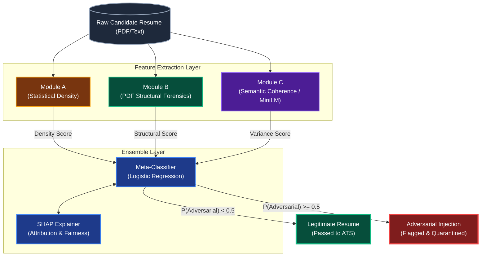

# System Architecture Diagram (For IEEE Paper)

You can copy and paste the Mermaid code below directly into any markdown viewer that supports Mermaid (like GitHub), or use [Mermaid Live Editor](https://mermaid.live/) to export it as a high-resolution PNG for your Capstone manuscript.

